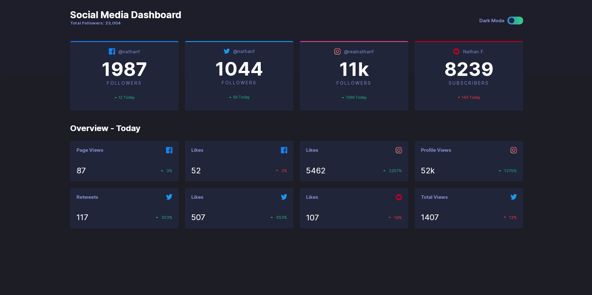
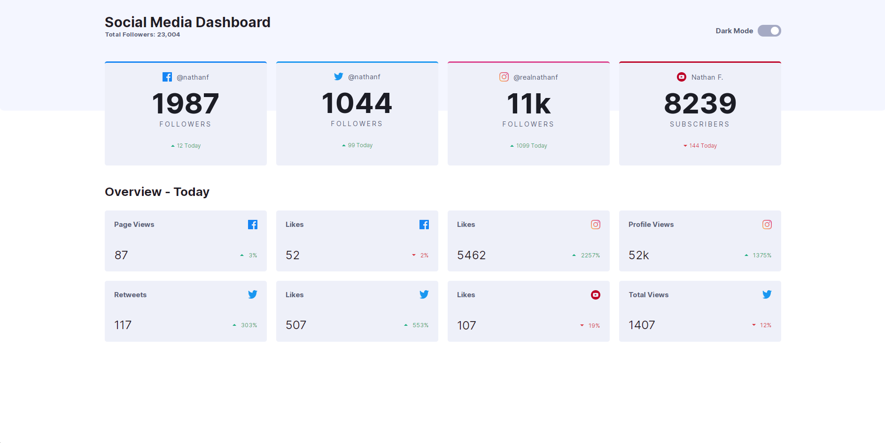
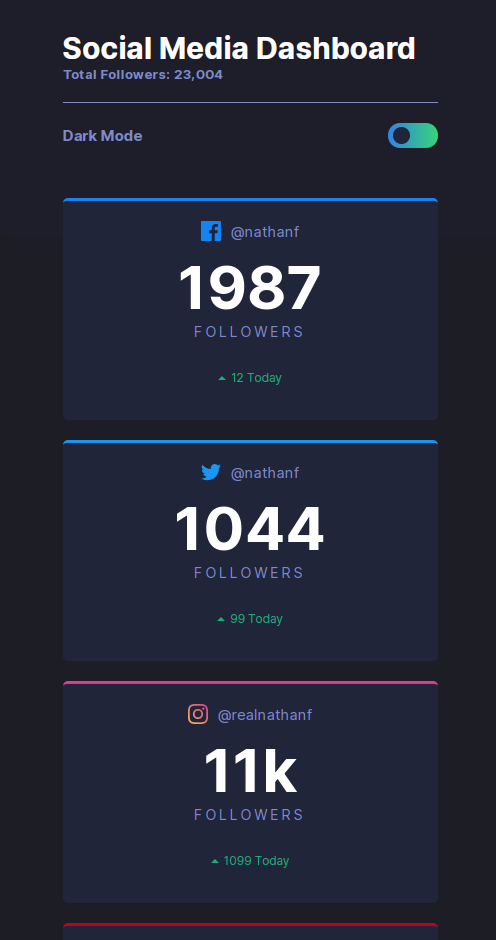
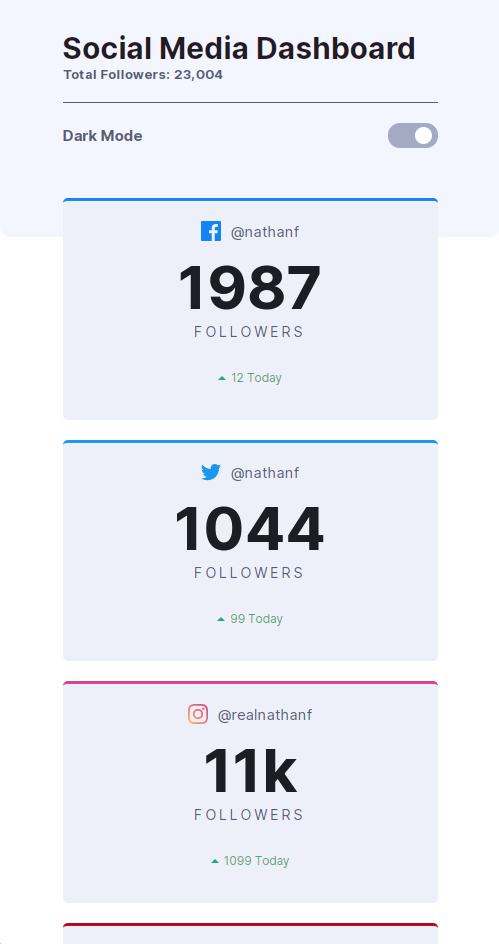

# Frontend Mentor - Social media dashboard with theme switcher solution

This is a solution to the [Social media dashboard with theme switcher challenge on Frontend Mentor](https://www.frontendmentor.io/challenges/social-media-dashboard-with-theme-switcher-6oY8ozp_H). Frontend Mentor challenges help you improve your coding skills by building realistic projects.

## Table of contents

- [Overview](#overview)
  - [The challenge](#the-challenge)
  - [Screenshot](#screenshot)
  - [Links](#links)
- [My process](#my-process)
  - [Built with](#built-with)
  - [What I learned](#what-i-learned)
  - [Useful resources](#useful-resources)
- [Author](#author)

## Overview

Social Media Dashboard that displays a users follower / subscriber count for four different social networks.
An overview section is included to show the status of each network for that day.

### The challenge

Users should be able to:

- View the optimal layout for the site depending on their device's screen size
- See hover states for all interactive elements on the page
- Toggle color theme to their preference

### Screenshot

### Links

- Solution URL: [https://github.com/jchapar/social_media_dash]
- Live Site URL: [https://jchapar.github.io/social_media_dash/]

## My process

I started this project with a mobile approach. I finished all of the HTML markup before beggining to style each part one by one.
After styling the header, I began working on getting the JS functionality completed for the theme toggle.
After completing, I working on styling the following two sections before moving on towards the desktop version.

### Built with

- Semantic HTML5 markup
- CSS custom properties
- SASS
- Vanilla JavaScript
- Flexbox
- CSS Grid
- Mobile-first workflow

### What I learned

I went into this project with the mindset to not overthink the styling layout and to keep it simple.
I found that by starting with a mobile approach, it was simplier to add the media queries for the desktop version.

### Useful resources

- [https://www.udemy.com/course/the-modern-flexbox-grid-sass-animations-developer-course/] - Starting this course earlier this year, I used what was shown in one of the projects to help me style the toggle button using a checkbox input as well as understanding the JS functionality for toggling the html theme.

## Author

- Frontend Mentor - [@jchapar](https://www.frontendmentor.io/profile/jchapar)
- Twitter - [@j_chapar](https://www.twitter.com/J_chapar)
